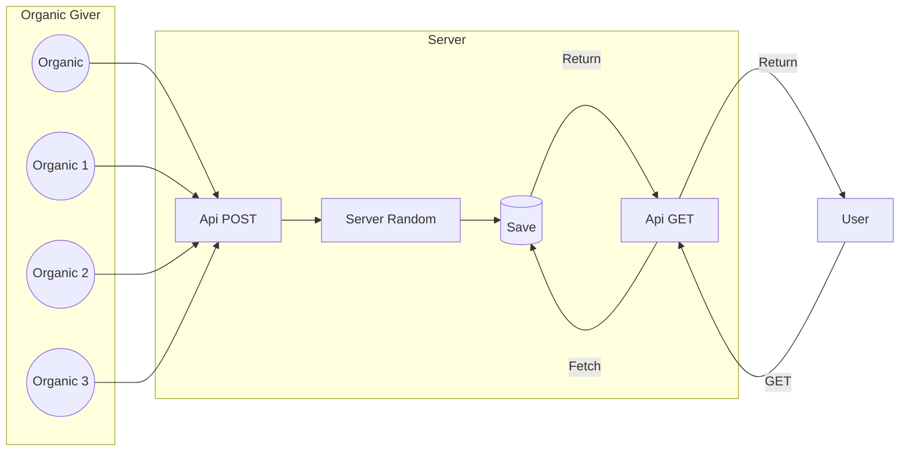

<!-- L'idée c'est que ce soit autonome, même s'il n'y a pas de source organique -->
<!-- Installation simple via docker -->
<!-- Organiser les source en deux dossier -->
<!-- Un fichier par algo -->

# LunaticProject

LunaticProject is a collaborative project for generating a random number from other randomly generated numbers, both organically and computationally, according to various server-generated and user-generated processes.

## Une entrée, une sortie



## Random source

### Organic Random

Ideas : 
- From x and y coordonate (re-randomised) mouth's move
- From Tweet converted in integer

### Server Random

Ideas :
- Random function from programation language
- Re-compute from already saved number
    - Multiply
    - Xor
- Other Service random number
- From IA images

## Request

### Post  

```url
[DOMAIN]/give?number=1
[DOMAIN]/give?numbers=1-2-3-4-5-6-7-8-9
```

### Get  

```url
[DOMAIN]/api/get
[DOMAIN]/api/get?numberDigit=3
[DOMAIN]/api/get?min=1&max=999
```

## Installation

Run the docker compose.

At installatoin, 1k numbers gonna be generate by server.

## DataBase

| id | origin | datetime | number |
|--|--|--|--|
| 1 | organic   | ... | 78
| 2 | server    | ... | 789
| 3 | server    | ... | 7159
| 4 | organic   | ... | 3894
| 5 | organic   | ... | 5878
