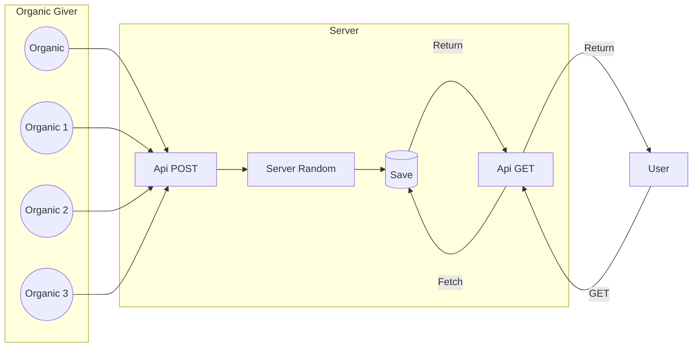

# LunaticProject

LunaticProject est un projet collaboratif permettant de générer un nombre aléatoire à partir de d'autres nombres générés aléatoirement de manière organique et informatique Selon différents procédés généré par le serveur et par les utilisateurs.

## Une entrée, une sortie



## Random source

### Organic Random

Ideas : 
- From x and y coordonate (re-randomised) mouth's move
- From Tweet converted in integer

### Server Random

Ideas :
- Random function from programation language
- Re-compute from already saved number
    - Multiply
    - Xor
- Other Service random number
- From IA images

## Request

### Post  

```url
[DOMAIN]/give?number=1
[DOMAIN]/give?numbers=1-2-3-4-5-6-7-8-9
```

### Get  

```url
[DOMAIN]/get
[DOMAIN]/get?numberDigit=3
[DOMAIN]/get?min=1&max=999
```