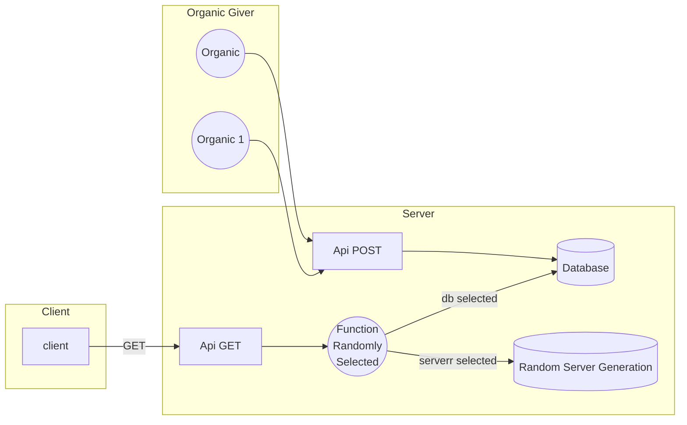

<!-- L'idée c'est que ce soit autonome, même s'il n'y a pas de source organique -->
<!-- Installation simple via docker -->
<!-- Organiser les source en deux dossier -->
<!-- Un fichier par algo -->

# LunaticProject

LunaticProject is a collaborative project for generating a random number from other randomly generated numbers, both organically and computationally, according to various server-generated and user-generated processes.

## Random source

Ideas : 
- From x and y coordonate (re-randomised) mouth's move
- From Tweet/redit converted in integer

## One entry, one exit



## Request

### Add  

```url
[DOMAIN]/give?number=1
[DOMAIN]/give?numbers=1-2-3-4-5-6-7-8-9
```

### Get  

```url
// Get from all function referenced
[DOMAIN]/api/get
// Get from a specific function
[DOMAIN]/api/get?function=simpleRandom
```

## Installation

Run the docker compose.

At installatoin, 1k numbers gonna be generate by server.

```
sudo docker compose up
npm run start
npm run start-up
```

## Developement Dashboard

On develop environment go to `/dev/`

## DataBase

__To know more__ :
When a random number from the database is called, a check is made to see if there are enough numbers in the database. If there are less than half of START_NUMBER_QUANTITY then it adds half.

| id | origin | datetime | number |
|--|--|--|--|
| 1 | organic   | ... | 78
| 2 | server    | ... | 789
| 3 | server    | ... | 7159
| 4 | organic   | ... | 3894
| 5 | organic   | ... | 5878

## Add your function

In `/src/randomSrc/FILE_NAME.js` add a function like
```javascript
export const yourFunction = async () => {
    return number
}
```
then import it into /src/routes/router.js like 
```javascript
import {
    yourFunction
} from '../randomSrc/FILE_NAME.js'
```
and add the name function in `functionCollection`
```javascript
const functionCollection = {
    ...,
    yourFunction
}
```

When you get `/api/get`, your function gonna be randomly selected.