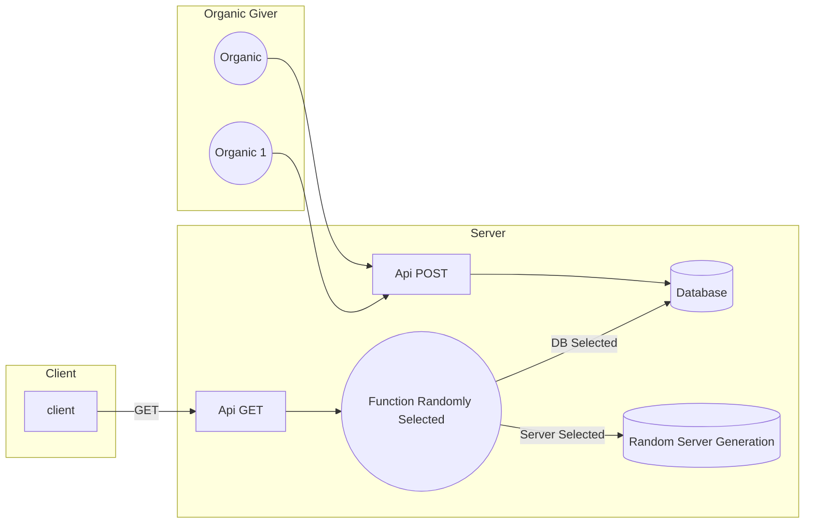

# LunaticProject

LunaticProject is a collaborative project aimed at generating a random number from other randomly generated numbers, both organically and computationally (user or computer), and adding several layers of antropy.

## Random source

### Server 

There already are many function with many different level of antropy.

### Organic

You can send random number generated from human source like tweet, reddit or mouse move with _give_ routes like that :

```javascript
 const randomMouse = () => {
            let randomCollection = []
            let canSend = true
            document.addEventListener("mousemove", async (evt) => {
                randomCollection.push(String(parseInt(Math.random() * parseInt(evt.clientY + evt.clientX / 10))))
                if(randomCollection.length === 150 && canSend) {
                    canSend = false
                    randomCollectionString = randomCollection.join("-")
                    await fetch("/api/giveMany?numbers="+randomCollectionString).then((res) => {
                        canSend = true
                        randomCollection = []
                    })
                }
            })
        }
    
        randomMouse()
```

I had an idea: get the white noise from the radio (with an rtl-srd for example) and use it as a seed. 

## How it works



## Request

### Add  

```url
[DOMAIN]/give?number=1
[DOMAIN]/giveMany?numbers=1-2-3-4-5-6-7-8-9
```

### Get  

```url
// Get from all function referenced
[DOMAIN]/api/get
// Get from a specific function
[DOMAIN]/api/get?function=simpleRandom
// Get with min and max value
[DOMAIN]/api/get?min=0&max=10
```

## Install

Run the docker compose.

At installatoin, 1k numbers gonna be generate by server.

```shell
sudo docker compose up
npm install
npm run start
npm run start-up
```

## Developement Dashboard

On develop environment go to `/dev/`

## DataBase

__To know more__ :
When a random number from the database is called, a check is made to see if there are enough numbers in the database. If there are less than half of START_NUMBER_QUANTITY then it adds half.

| id | origin | datetime | number |
|--|--|--|--|
| 1 | organic   | ... | 78
| 2 | server    | ... | 789
| 3 | server    | ... | 7159
| 4 | organic   | ... | 3894
| 5 | organic   | ... | 5878

## Add your function

In `/src/randomSrc/FILE_NAME.js` add a function like
```javascript
export const yourFunction = async () => {
    return number
}
```
then import it into /src/routes/router.js like 
```javascript
import {
    yourFunction
} from '../randomSrc/FILE_NAME.js'
```
and add the name function in `functionCollection`
```javascript
const functionCollection = {
    ...,
    yourFunction
}
```

When you get `/api/get`, your function gonna be randomly selected.

___

[TESTS](./tests.md)
___
# Improve it 
_The todo list_
- Turn "give" and "giveMany" on POST
- Deploy on docker